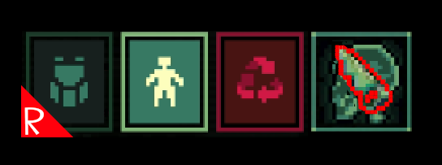

# Quasimorph Recycle Hotkey

Amputate and recycle corpses by pressing a hot key.  Z recycles for current corpse screen (backpack or body), and A to amputate.  Keys can be configured.

To always amputate when recycling items, set the config value `RecycleAlsoAmputates` to true. 

Has an option to amputate without having or damaging a weapon capable of amputation (melee weapons).  Disabled by default.

See configuration below.

# Filtering Out Items
Use the mod "I Don't Want That! (Filter pickup items)" to avoid picking up items that are not wanted after recycle/amputation.  For example: legs, hands, flesh, more meat than is inventory, etc.

# Configuration

The configuration file will be created on the first game run and can be found at `%AppData%\..\LocalLow\Magnum Scriptum Ltd\Quasimorph_ModConfigs\QM_RecycleHotKey\config.json`.

|Key|Default|Description|
|--|--|--|
|RecycleCurrentPageKey|Z|Invokes the recycle/dismember action for the current page|
|AmputateKey|A|Amputates all of the corpse's parts|
|RecycleAlsoAmputates|false|If true, will also amputate when the recycling hotkey is pressed|
|AmputateWithoutWeapon|false|If true, will execute the amputation action without requiring or using a weapon that can amputate.|

Valid keys can be found at the bottom of https://docs.unity3d.com/ScriptReference/KeyCode.html
There are some oddities such as the number 1 is actually Alpha1.

# Support
If you enjoy my mods and want to buy me a coffee, check out my [Ko-Fi](https://ko-fi.com/nbkredspy71915) page.
Thanks!

# Source Code
Source code is available on GitHub at https://github.com/NBKRedSpy/QM_RecycleHotKey

# Change Log

## 1.5.0
Fix: This mod was preventing the "I Don't Want That!" from filtering amputated items when the AmputateWithoutWeapon option was enabled.
Thank you to Discord user Necrosx for reporting the issue.

## 1.4.0
* Version 0.8.6 compatibility

## 1.3.0
* v0.8.5 compatible.

## 1.2.0
* Moved config file directory.

## 1.1.0
* Added option to amputate without a melee weapon.  
    * Suggested by Steam user VETXP

